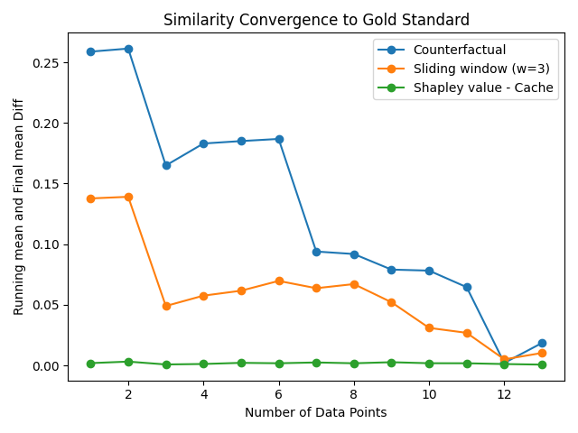

# 🩺 Symptom–Disease Dataset

## Overview

This dataset contains labeled disease cases with associated symptoms. Each row represents one patient record, listing symptoms across multiple columns (`Symptom_1`, `Symptom_2`, …) and the corresponding `Disease`.

---

### Data Cleaning

* **Original dataset:** [Disease Symptom Prediction](https://www.kaggle.com/datasets/itachi9604/disease-symptom-description-dataset).
* **Detected duplicates:** 4,616
* **Removed duplicates:** 4,616
* **Filtered dataset:** kept only 2 samples per symptom count (4–10 symptoms)
* **Output file:** `reduced_symptom_dataset.csv`
* **Final dataset size:** 14

Duplicates were removed using exact row matching (`pandas.DataFrame.drop_duplicates()`), ensuring only one unique record per symptom combination and disease remains.

---
## Analysis

The following plot shows how quickly each method’s similarity to the *gold standard* stabilizes as more data points are used. The y-axis represents how far the running mean similarity at each step is from the final overall mean, so a curve that drops quickly toward zero indicates faster convergence. In short, flatter lines near the bottom mean the method’s similarity become reliable with fewer data points.

